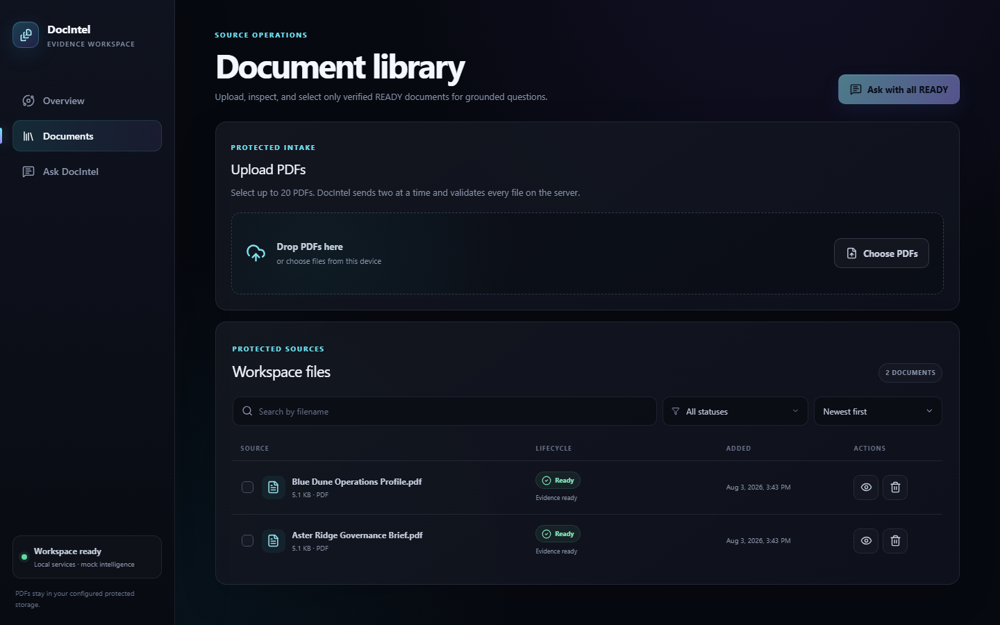
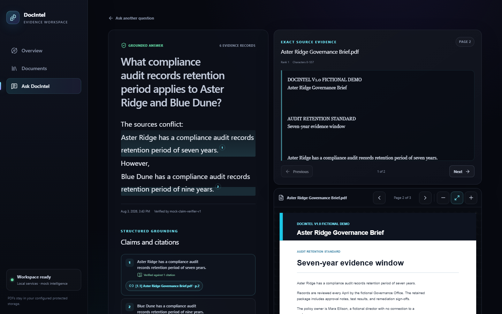
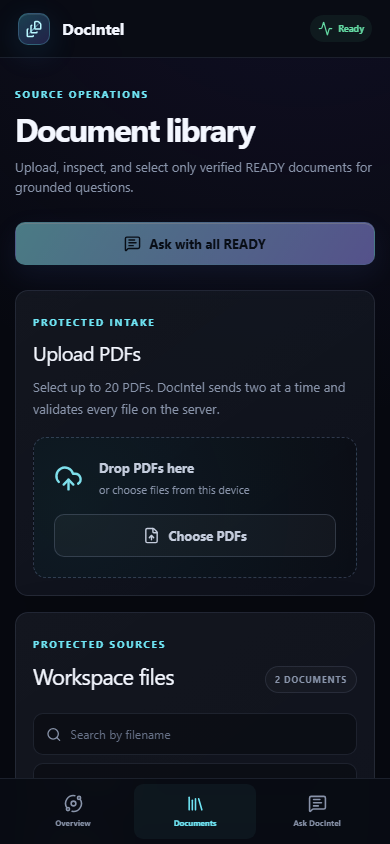

# DocIntel v1.0

DocIntel is a local document-intelligence workspace that turns PDFs into
auditable, page-correct answers. It combines secure streaming uploads,
deterministic processing, pgvector retrieval, structured grounded answers,
claim-support verification, exact evidence snapshots, and a responsive PDF
workspace in one reproducible Docker Compose application.

> [!IMPORTANT]
> DocIntel v1.0 is an unauthenticated local portfolio application. Its ports
> bind to loopback by default. Do not expose it to a LAN or the public internet
> without authentication, authorization, transport security, and an additional
> security review.

## Product tour



*The responsive document workspace shows real lifecycle state, search,
filtering, selection, retry, deletion, and protected source access.*



*Citations resolve to immutable evidence snapshots, original one-based page
numbers, exact excerpts, and the production PDF.js viewer.*



*The same production workspace adapts to a compact mobile viewport with
keyboard-visible focus, semantic controls, and reduced-motion support.*

## What v1.0 demonstrates

The complete browser workflow supports:

1. streaming one or more PDFs through a bounded upload queue;
2. durable validation, extraction, page storage, chunking, and mock embeddings;
3. truthful processing progress, retryable failures, and safe deletion;
4. search, lifecycle filtering, source selection, and PDF inspection;
5. compatible-space cosine retrieval with deterministic diversity controls;
6. evidence-dependent grounded answers from offline mock providers;
7. structured claims, citations, immutable evidence, and claim verification;
8. exact filename, page, character-offset, excerpt, and hash validation;
9. deliberate insufficient-evidence responses instead of fabricated answers;
10. citation-driven navigation to the correct protected PDF page.

DocIntel does not implement authentication, OCR, non-PDF ingestion, multi-turn
chat, streaming answers, web search, agents, collaboration, or cloud
deployment. See [Current limitations](#current-limitations).

## Architecture at a glance

```text
Production browser workspace (React + TypeScript + nginx + PDF.js)
                              |
                              v
                       FastAPI /api/v1
                       /       |       \
                      v        v        v
          PostgreSQL/pgvector  retrieval  protected PDF storage
                    ^             |
                    |             v
          durable lifecycle     grounded answer + verifier providers
                worker          (deterministic mock by default)
```

Compose runs five services:

- `db`: PostgreSQL 17 with pgvector;
- `migrate`: one-shot Alembic upgrade through `20260730_0004`;
- `api`: health, document lifecycle, content, retry, and question APIs;
- `worker`: durable processing and deletion jobs with leases and recovery;
- `web`: production static assets served by nginx with SPA fallback.

The API and worker share one packaged Python application. PostgreSQL is the
system of record and job queue. Client filenames are display metadata only;
stored files use server-generated UUID keys. Read the detailed
[v1.0 architecture](docs/architecture.md).

## Windows prerequisites

- Windows 10 or 11 with an `E:` drive for project and persistent data
- Git
- Docker Desktop using the Linux container engine and Docker Compose v2
- PowerShell 5.1 or newer
- Python 3.13 for the demo generator and local backend validation
- Node.js 24 for local frontend validation

The supported repository location is `E:\DocIntel`. Normal persistent data
lives outside Git under `E:\DocIntelData`.

## Reproducible bootstrap

From PowerShell in `E:\DocIntel`:

```powershell
.\scripts\bootstrap.ps1
```

If Windows PowerShell blocks reviewed local scripts under the machine's
execution policy, use a process-scoped bypass. This does not change the global
or user execution policy:

```powershell
powershell.exe -NoProfile -ExecutionPolicy Bypass -File .\scripts\bootstrap.ps1
```

The idempotent bootstrap checks Git, Docker Compose, and the Linux engine;
creates the five required E-drive data directories; and creates `.env` from
`.env.example` only when `.env` is absent. It never overwrites an existing
`.env` or deletes stored data.

To use a separate E-drive root for a clean demonstration:

```powershell
.\scripts\bootstrap.ps1 -DataRoot E:\DocIntelV1Demo\data
```

With the process-scoped bypass, pass the same root after `-File`:

```powershell
powershell.exe -NoProfile -ExecutionPolicy Bypass -File .\scripts\bootstrap.ps1 -DataRoot E:\DocIntelV1Demo\data
```

The resulting directories are:

```text
E:\DocIntelData\postgres
E:\DocIntelData\uploads
E:\DocIntelData\processed
E:\DocIntelData\samples
E:\DocIntelData\backups
```

Paths are configuration, not application constants. Linux CI supplies its own
absolute temporary root instead of inheriting the Windows default.

## Start and stop the production application

Build and start the production images:

```powershell
docker compose up --build -d
docker compose ps
```

Open:

- Workspace: <http://localhost:5173>
- API contract: <http://localhost:8000/docs>
- Liveness: <http://localhost:8000/api/v1/health/live>
- Readiness: <http://localhost:8000/api/v1/health/ready>

The database, API, and web ports bind to `127.0.0.1` by default. An alternate
`DOCINTEL_BIND_ADDRESS` is available for an intentional, separately reviewed
exposure; it is not recommended for this unauthenticated release.

Stop containers while preserving every bind-mounted file:

```powershell
docker compose down
```

Do not use broad Docker pruning or delete `E:\DocIntelData` during ordinary
shutdown. See [data preservation](docs/troubleshooting.md#data-preservation-and-cleanup).

## Offline demo with deterministic PDFs

Generate the two fictional documents outside the repository:

```powershell
py -3.13 .\scripts\generate_demo_pdfs.py `
  --output-dir E:\DocIntelV1Demo\samples
```

The generator uses only the Python standard library, makes no network request,
accepts only an explicit safe absolute output directory, and refuses unrelated
or different existing files. Equivalent runs produce byte-identical PDFs.

Upload both documents through **Documents**, wait for `READY`, select them, and
ask:

> What compliance audit records retention period applies to Aster Ridge and Blue Dune?

The grounded result should cite Aster Ridge page 2 and Blue Dune page 3. To see
the deliberate refusal state, ask:

> What is the orbital launch authorization code?

Complete steps and expected hashes are in the
[demo workflow](docs/demo-workflow.md).

## Provider configuration

### Default: deterministic mock

`DOCINTEL_AI_PROVIDER=mock` is the supported demonstration mode. It requires no
API key, never opens a provider network connection, and deterministically
produces 1,536-dimensional embeddings, evidence-dependent answers, and
claim-verification results. Readiness validates configuration only; it does not
make an AI request.

### Optional: OpenAI-compatible

An optional adapter exists for explicitly configured OpenAI-compatible
embedding and structured-chat endpoints. It is disabled by default and has not
been called during release validation. Configure it only in an untracked
`.env`:

```text
DOCINTEL_AI_PROVIDER=openai_compatible
DOCINTEL_AI_BASE_URL=https://provider.example/v1
DOCINTEL_AI_API_KEY=replace-in-local-env-only
DOCINTEL_AI_CHAT_MODEL=provider-chat-model
DOCINTEL_AI_EMBEDDING_MODEL=provider-embedding-model
DOCINTEL_EMBEDDING_DIMENSIONS=1536
DOCINTEL_AI_STRUCTURED_OUTPUT=true
```

The provider must support schema-constrained JSON and 1,536-dimensional
embeddings. Use a fresh isolated data root when changing embedding providers;
DocIntel fails safely rather than comparing incompatible embedding spaces.
Never put credentials in source files, frontend code, screenshots, or Git.

## Trustworthy citation model

Retrieved PDF text is untrusted source data, never an instruction. Before an
answer becomes visible, DocIntel checks that:

- every factual claim exactly matches its stored answer span;
- every claim has at least one structured citation;
- every citation targets evidence retrieved for the same question;
- document, processing revision, page, chunk, offsets, text, and hashes match;
- the excerpt is an exact non-empty slice of normalized one-based page text;
- the source remains `READY`, current, and not deleting;
- the structured verifier supports every material claim using retrieved
  evidence only.

If any gate fails, the unsupported provider answer is not shown. The persisted
result becomes `insufficient_evidence` with bounded diagnostic metadata.

## Validation

Release checks cover frozen Python installs, package artifacts, Ruff, strict
mypy, 71 backend unit tests, 23 PostgreSQL/pgvector integration tests, Alembic
upgrade and drift checks, Python and npm audits, frontend lint/type/build, 19
component tests, production image builds, isolated Compose health, two
Playwright browser workflows, production PDF.js rendering, and 11 axe scans
with zero serious or critical violations.

Commands and the owner-only native Windows gate are documented in the
[release validation checklist](docs/release-validation.md). CI mirrors the
packaged production topology and tears down only its unique run-specific
Compose project and data root.

## Security and data handling

- Ports are loopback-only by default.
- Real `.env` files and credentials are ignored by Git.
- PDF uploads are streamed, size bounded, signature checked, hashed, and
  atomically finalized.
- Display filenames never become storage paths.
- Stored PDFs and extracted content are sensitive local data; protect the
  entire E-drive data root and its backups.
- API errors and logs exclude document contents, provider payloads, secrets,
  and unrestricted exceptions.
- Deleting a source removes its file, derived data, jobs, and dependent answer
  aggregates before the result can continue to appear valid.

Read [SECURITY.md](SECURITY.md) before using any non-fictional document.

## Current limitations

- The application is local and unauthenticated; it is not a production SaaS.
- PDF text extraction is deterministic but OCR is not implemented. Image-only
  PDFs fail safely with `NO_EXTRACTABLE_TEXT`.
- Only PDFs are supported.
- PDF text geometry is not persisted. Citations open the proven one-based page
  and keep the exact excerpt beside the viewer; DocIntel does not guess visual
  highlight coordinates.
- A successfully uploaded queue row can occasionally remain visible until the
  page is refreshed. Upload acceptance, library appearance, processing,
  deletion, and persisted state remain correct.
- OpenAI-compatible transport is optional but release validation uses mocked
  HTTP only; no live-provider interoperability claim is made.
- There is no authentication, multi-user authorization, OCR, web search,
  agentic tooling, conversation memory, streaming chat, collaboration,
  sharing, annotations, billing, or deployment automation.

## Documentation

- [Architecture](docs/architecture.md)
- [Deterministic demo workflow](docs/demo-workflow.md)
- [Release validation](docs/release-validation.md)
- [Troubleshooting](docs/troubleshooting.md)
- [Security policy](SECURITY.md)
- [Release notes](RELEASE_NOTES.md)
- [Changelog](CHANGELOG.md)
