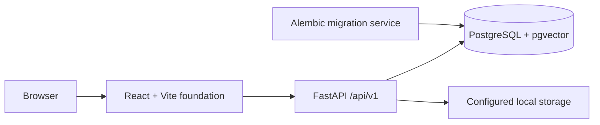

# Phase 2 architecture

## Scope

Phase 2 establishes the repository and platform boundary needed by later
DocIntel phases. It contains no document-intelligence implementation.

The implemented runtime services are:

- `db`: PostgreSQL 17 with pgvector.
- `migrate`: a one-shot Alembic upgrade using the backend image.
- `api`: FastAPI with liveness and dependency-aware readiness endpoints.
- `web`: a minimal React/Vite shell that reports API platform health.

The approved architecture also defines a durable worker sharing the backend
codebase and PostgreSQL database. It is intentionally absent in Phase 2 because
there are no lifecycle jobs until Phase 3.

## Boundaries



- `apps/api` owns configuration, database connectivity, migrations, health
  contracts, and readiness checks.
- `apps/web` owns the browser runtime and typed health client.
- PostgreSQL is the future system of record and durable job queue.
- Storage paths are configuration, never filenames supplied by a user.
- The AI provider is set to `mock`; Phase 2 validates configuration only.

## Persistent storage

Compose bind-mount sources come from `.env` and are documented in
`.env.example`. The approved Windows layout is:

```text
E:\DocIntelData\postgres
E:\DocIntelData\uploads
E:\DocIntelData\processed
E:\DocIntelData\samples
E:\DocIntelData\backups
```

Inside the API container, document-related mounts use `/data/*`. This keeps
machine-specific paths outside application logic.

## Health contracts

`GET /api/v1/health/live` has no dependency checks. It proves only that the
process can respond.

`GET /api/v1/health/ready` reports these named components:

- `database`
- `pgvector`
- `migration`
- `storage`
- `provider`

Readiness is HTTP 200 only when every component is ready; otherwise it is HTTP
503. Provider readiness never calls an external model. For the deterministic
mock selection it verifies the configured embedding dimension. For a future
OpenAI-compatible selection it checks required configuration values and
structured-output capability without using credentials.

## Database baseline

The first migration installs the `vector` extension. It deliberately creates no
document, page, chunk, job, question, answer, or citation tables. Those schemas
belong to the phases that implement their lifecycle invariants.

The backend uses SQLAlchemy 2.x asynchronous engines with Psycopg 3. Alembic is
the only supported schema-change path.

## Deferred work

The following are not part of this phase:

- PDF upload or validation
- document storage operations
- extraction, chunking, or processing jobs
- embedding or retrieval operations
- answer generation or citation validation
- document library, dashboard, workspace, or PDF viewer
- production deployment and authentication
