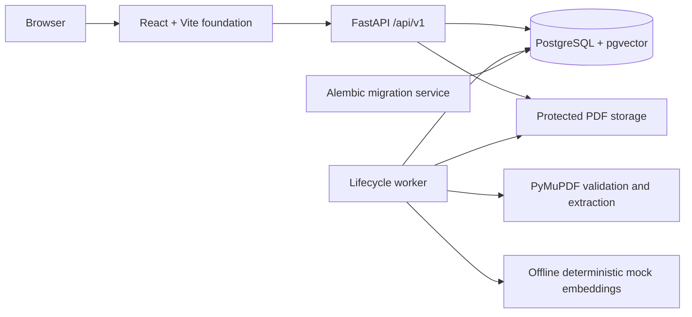

# Phase 4 architecture

## Scope

Phase 4 extends the secure PDF lifecycle with deterministic local processing. A
valid uploaded PDF can reach `READY` with one-based pages, page-contained
chunks, and normalized offline mock vectors.

The implemented runtime services are:

- `db`: PostgreSQL 17 with pgvector.
- `migrate`: a one-shot Alembic upgrade using the backend image.
- `api`: FastAPI health, upload, document metadata, content, and deletion APIs.
- `worker`: a durable processing and deletion job consumer.
- `web`: a minimal React/Vite shell that reports API platform health.

## Boundaries



- `apps/api` owns configuration, database connectivity, migrations, health and
  document contracts, protected storage, deterministic processing, and durable
  deletion.
- `apps/web` owns the browser runtime and typed health client.
- PostgreSQL is the system of record and durable lifecycle-job queue.
- Storage paths and keys are trusted server values, never client filenames.
- The provider is set to the offline deterministic `mock`; readiness validates
  configuration without making a provider request.

## Persistent storage

Compose bind-mount sources come from `.env` and are documented in
`.env.example`. The approved Windows layout is:

```text
E:\DocIntelData\postgres
E:\DocIntelData\uploads
E:\DocIntelData\processed
E:\DocIntelData\samples
E:\DocIntelData\backups
```

Inside the API container, document-related mounts use `/data/*`. This keeps
machine-specific paths outside application logic.

PDFs are stored under the configured uploads root using a generated
`{document_uuid}.pdf` key. Uploads first use a hidden generated `.part` file;
successful writes are flushed, synchronized, and atomically renamed. Failed
uploads remove the partial file.

## Health contracts

`GET /api/v1/health/live` has no dependency checks. It proves only that the
process can respond.

`GET /api/v1/health/ready` reports these named components:

- `database`
- `pgvector`
- `migration`
- `storage`
- `provider`

Readiness is HTTP 200 only when every component is ready; otherwise it is HTTP
503. Provider readiness never calls an external model. For the deterministic
mock selection it verifies the configured embedding dimension. For a future
OpenAI-compatible selection it checks required configuration values and
structured-output capability without using credentials.

## Database lifecycle

Revision `20260730_0001` installs the `vector` extension. Revision
`20260730_0002` adds:

- `documents`, which owns safe display metadata, generated storage identity,
  content hash and size, lifecycle status/stage/progress, and sanitized error
  state.
- `document_jobs`, which owns durable processing and deletion work, retries,
  leases, cancellation, and safe error state.

The document and its initial processing job are inserted in one transaction.
Phase 3 processing jobs remain queued until the Phase 4 worker is deployed. An
active-job partial unique index prevents duplicate queued/running jobs of the
same kind for a document.

Deletion is requested under a document row lock. Queued processing is cancelled,
running processing is marked for cancellation, and one deletion job is
enqueued. The worker claims deletion jobs with row locking and `SKIP LOCKED`,
deletes the physical PDF, verifies it is absent, and only then removes the
database aggregate. File failures retain the document in `deleting` with
retry-safe state.

Revision `20260730_0003` adds only the deterministic processing aggregate:

- `document_pages` stores complete normalized page text, one-based page number,
  dimensions, character count, and SHA-256.
- `chunks` stores exact page slices, page/document ordering, offsets, hashes,
  processing revision, and chunker version.
- `embedding_spaces` identifies provider, model, dimensions, cosine metric, and
  canonical configuration hash.
- `chunk_embeddings` stores one `vector(1536)` per chunk and active embedding
  space, with an HNSW cosine index.

Documents and jobs gain processing revision, stage progress, retryability,
lease heartbeat, and stage/processing timestamps. No retrieval, question,
answer, evidence, claim, or citation schema exists.

## Deterministic processing

The processing state sequence is:

```text
QUEUED -> VALIDATING -> EXTRACTING -> CHUNKING -> EMBEDDING -> READY
```

The worker claims queued or expired processing jobs using
`FOR UPDATE SKIP LOCKED`. It renews the lease after meaningful page, stage, and
embedding-batch progress. An interrupted attempt is reconciled by removing
stale derived rows before deterministic restart.

PyMuPDF validates the stored PDF, encryption state, page tree, and configurable
page limit. Page text uses NFKC normalization, normalized line endings, and
explicit removal of NUL/form-feed noise. Blank pages retain their original page
numbers; a document with no extractable text fails permanently because OCR is
outside scope.

The versioned chunker targets 1,400 characters, never exceeds 1,800, and uses
approximately 200 characters of overlap. It prefers paragraph, sentence, then
whitespace boundaries and never crosses a page. Every stored chunk is verified
against its exact normalized page-text slice.

The mock embedding provider uses signed SHA-256 token hashing and L2
normalization to generate stable 1,536-dimensional vectors entirely offline.
Vector count, dimensions, finite values, and embedding-space identity are
validated before persistence.

`READY` is committed only after the stored PDF and actual page count are
revalidated and the database proves complete pages, chunks, vectors, revision,
ordering, and cancellation invariants.

## API behavior

`POST /api/v1/documents` accepts one multipart `file`. The API sanitizes the
display name, requires `.pdf` and an `application/pdf` hint, validates the
leading `%PDF-` signature, enforces the configured size while reading fixed
chunks, and calculates SHA-256 during the write.

`GET /api/v1/documents` supports `search`, repeated `status`, `sort`, `order`,
`limit`, and an opaque cursor. Detail and compact status routes use the document
UUID. The content route returns `application/pdf` inline with a strong SHA-256
ETag, conditional 304 support, and RFC-style single byte ranges.

All API failures use sanitized `application/problem+json` responses and expose
a trace ID. A safe caller-supplied `X-Request-ID` can be propagated; otherwise
the API generates one.

`POST /api/v1/documents/{document_id}/retry` accepts only failed documents whose
safe error is classified retryable. It transactionally removes stale derived
rows, increments the processing revision, and creates one new durable
processing job. Permanent PDF validation failures cannot be retried.

## Deferred work

The following are not part of Phase 4:

- vector retrieval, semantic search, or ranking
- answer generation or citation validation
- evidence, claim, question, answer, or citation APIs
- live or OpenAI-compatible providers
- OCR
- document library, dashboard, workspace, or PDF viewer
- production deployment and authentication
