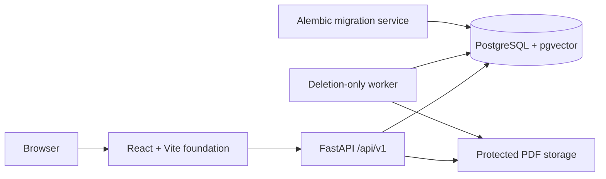

# Phase 3 architecture

## Scope

Phase 3 adds the secure PDF lifecycle to the Phase 2 platform foundation. It
stores valid PDFs and their lifecycle records, exposes protected document APIs,
and durably deletes the file and database aggregate.

The implemented runtime services are:

- `db`: PostgreSQL 17 with pgvector.
- `migrate`: a one-shot Alembic upgrade using the backend image.
- `api`: FastAPI health, upload, document metadata, content, and deletion APIs.
- `worker`: a deletion-only durable-job consumer.
- `web`: a minimal React/Vite shell that reports API platform health.

## Boundaries



- `apps/api` owns configuration, database connectivity, migrations, health and
  document contracts, protected storage, and durable deletion.
- `apps/web` owns the browser runtime and typed health client.
- PostgreSQL is the system of record and durable lifecycle-job queue.
- Storage paths and keys are trusted server values, never client filenames.
- The AI provider is set to `mock`; Phase 2 validates configuration only.

## Persistent storage

Compose bind-mount sources come from `.env` and are documented in
`.env.example`. The approved Windows layout is:

```text
E:\DocIntelData\postgres
E:\DocIntelData\uploads
E:\DocIntelData\processed
E:\DocIntelData\samples
E:\DocIntelData\backups
```

Inside the API container, document-related mounts use `/data/*`. This keeps
machine-specific paths outside application logic.

PDFs are stored under the configured uploads root using a generated
`{document_uuid}.pdf` key. Uploads first use a hidden generated `.part` file;
successful writes are flushed, synchronized, and atomically renamed. Failed
uploads remove the partial file.

## Health contracts

`GET /api/v1/health/live` has no dependency checks. It proves only that the
process can respond.

`GET /api/v1/health/ready` reports these named components:

- `database`
- `pgvector`
- `migration`
- `storage`
- `provider`

Readiness is HTTP 200 only when every component is ready; otherwise it is HTTP
503. Provider readiness never calls an external model. For the deterministic
mock selection it verifies the configured embedding dimension. For a future
OpenAI-compatible selection it checks required configuration values and
structured-output capability without using credentials.

## Database lifecycle

Revision `20260730_0001` installs the `vector` extension. Revision
`20260730_0002` adds only:

- `documents`, which owns safe display metadata, generated storage identity,
  content hash and size, lifecycle status/stage/progress, and sanitized error
  state.
- `document_jobs`, which owns durable processing and deletion work, retries,
  leases, cancellation, and safe error state.

The document and its initial processing job are inserted in one transaction.
Processing jobs remain queued during this phase. An active-job partial unique
index prevents duplicate queued/running jobs of the same kind for a document.

Deletion is requested under a document row lock. Queued processing is cancelled,
running processing is marked for cancellation, and one deletion job is
enqueued. The worker claims deletion jobs with row locking and `SKIP LOCKED`,
deletes the physical PDF, verifies it is absent, and only then removes the
database aggregate. File failures retain the document in `deleting` with
retry-safe state.

## API behavior

`POST /api/v1/documents` accepts one multipart `file`. The API sanitizes the
display name, requires `.pdf` and an `application/pdf` hint, validates the
leading `%PDF-` signature, enforces the configured size while reading fixed
chunks, and calculates SHA-256 during the write.

`GET /api/v1/documents` supports `search`, repeated `status`, `sort`, `order`,
`limit`, and an opaque cursor. Detail and compact status routes use the document
UUID. The content route returns `application/pdf` inline with a strong SHA-256
ETag, conditional 304 support, and RFC-style single byte ranges.

All API failures use sanitized `application/problem+json` responses and expose
a trace ID. A safe caller-supplied `X-Request-ID` can be propagated; otherwise
the API generates one.

## Deferred work

The following are not part of Phase 3:

- extraction, page validation, chunking, or processing execution
- embedding or retrieval operations
- answer generation or citation validation
- document library, dashboard, workspace, or PDF viewer
- production deployment and authentication
