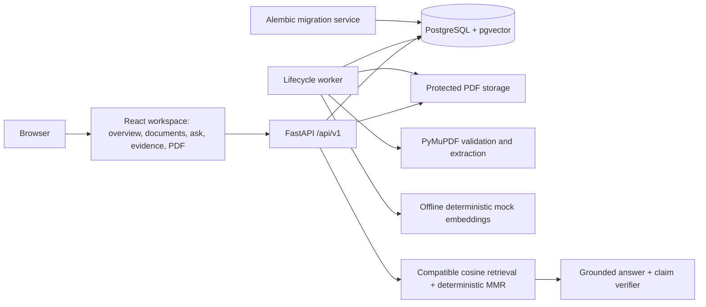

# DocIntel v1.0 architecture

## Scope

DocIntel v1.0 exposes the secure document lifecycle and grounded-answer backend
through one cohesive, production-packaged browser workspace. The frontend
preserves the backend as the source of truth: a document is selectable only
when it is `READY`, an answer is shown only when the persisted result is
`answered`, and every visual citation comes from structured claim and evidence
records.

The implemented runtime services are:

- `db`: PostgreSQL 17 with pgvector.
- `migrate`: a one-shot Alembic upgrade using the backend image.
- `api`: FastAPI health, document lifecycle, question, retrieval, and grounded
  answer APIs.
- `worker`: a durable processing and deletion job consumer.
- `web`: the responsive React document intelligence workspace, built by Vite
  and served as static production assets by nginx.

## Boundaries



- `apps/api` owns configuration, database connectivity, migrations, health and
  document contracts, protected storage, deterministic processing, and durable
  deletion.
- `apps/web` owns the browser runtime, centralized typed API client, bounded
  upload queue, lifecycle polling, grounded-answer presentation, and PDF.js
  viewer.
- PostgreSQL is the system of record, durable lifecycle-job queue, immutable
  evidence store, and grounded-answer audit log.
- Storage paths and keys are trusted server values, never client filenames.
- Offline deterministic mock providers are the default; readiness validates
  configuration without making a provider request. OpenAI-compatible adapters
  are disabled unless explicitly configured.

## Persistent storage

Compose bind-mount sources come from `.env` and are documented in
`.env.example`. The approved Windows layout is:

```text
E:\DocIntelData\postgres
E:\DocIntelData\uploads
E:\DocIntelData\processed
E:\DocIntelData\samples
E:\DocIntelData\backups
```

Inside the API container, document-related mounts use `/data/*`. This keeps
machine-specific paths outside application logic.

PDFs are stored under the configured uploads root using a generated
`{document_uuid}.pdf` key. Uploads first use a hidden generated `.part` file;
successful writes are flushed, synchronized, and atomically renamed. Failed
uploads remove the partial file.

## Health contracts

`GET /api/v1/health/live` has no dependency checks. It proves only that the
process can respond.

`GET /api/v1/health/ready` reports these named components:

- `database`
- `pgvector`
- `migration`
- `storage`
- `provider`

Readiness is HTTP 200 only when every component is ready; otherwise it is HTTP
503. Provider readiness never calls an external model. For the deterministic
mock selection it verifies the configured embedding dimension. For an
OpenAI-compatible selection it checks required configuration values and
structured-output capability without using credentials.

## Database lifecycle

Revision `20260730_0001` installs the `vector` extension. Revision
`20260730_0002` adds:

- `documents`, which owns safe display metadata, generated storage identity,
  content hash and size, lifecycle status/stage/progress, and sanitized error
  state.
- `document_jobs`, which owns durable processing and deletion work, retries,
  leases, cancellation, and safe error state.

The document and its initial processing job are inserted in one transaction.
Processing jobs remain queued until the durable worker claims them. An
active-job partial unique index prevents duplicate queued/running jobs of the
same kind for a document.

Deletion is requested under a document row lock. Queued processing is cancelled,
running processing is marked for cancellation, and one deletion job is
enqueued. The worker claims deletion jobs with row locking and `SKIP LOCKED`,
deletes the physical PDF, verifies it is absent, and only then removes the
database aggregate. File failures retain the document in `deleting` with
retry-safe state.

Revision `20260730_0003` adds only the deterministic processing aggregate:

- `document_pages` stores complete normalized page text, one-based page number,
  dimensions, character count, and SHA-256.
- `chunks` stores exact page slices, page/document ordering, offsets, hashes,
  processing revision, and chunker version.
- `embedding_spaces` identifies provider, model, dimensions, cosine metric, and
  canonical configuration hash.
- `chunk_embeddings` stores one `vector(1536)` per chunk and active embedding
  space, with an HNSW cosine index.

Documents and jobs gain processing revision, stage progress, retryability,
lease heartbeat, and stage/processing timestamps.

## Deterministic processing

The processing state sequence is:

```text
QUEUED -> VALIDATING -> EXTRACTING -> CHUNKING -> EMBEDDING -> READY
```

The worker claims queued or expired processing jobs using
`FOR UPDATE SKIP LOCKED`. It renews the lease after meaningful page, stage, and
embedding-batch progress. An interrupted attempt is reconciled by removing
stale derived rows before deterministic restart.

PyMuPDF validates the stored PDF, encryption state, page tree, and configurable
page limit. Page text uses NFKC normalization, normalized line endings, and
explicit removal of NUL/form-feed noise. Blank pages retain their original page
numbers; a document with no extractable text fails permanently because OCR is
outside scope.

The versioned chunker targets 1,400 characters, never exceeds 1,800, and uses
approximately 200 characters of overlap. It prefers paragraph, sentence, then
whitespace boundaries and never crosses a page. Every stored chunk is verified
against its exact normalized page-text slice.

The mock embedding provider uses signed SHA-256 token hashing and L2
normalization to generate stable 1,536-dimensional vectors entirely offline.
Vector count, dimensions, finite values, and embedding-space identity are
validated before persistence.

`READY` is committed only after the stored PDF and actual page count are
revalidated and the database proves complete pages, chunks, vectors, revision,
ordering, and cancellation invariants.

Revision `20260730_0004` adds only the grounded-answer audit aggregate:

- `questions` stores normalized input, selected document UUIDs, deterministic
  retrieval configuration, embedding-space identity, provider identities, and
  explicit answered or insufficient-evidence status.
- `evidence_snapshots` stores the exact display filename, document revision,
  one-based page, chunk, page-relative offsets, source text and hashes, score,
  rank, and embedding identity.
- `answers`, `answer_claims`, and `citations` keep answer text, exact factual
  claim spans, and normalized claim-to-evidence links separate.
- `claim_verifications` and `claim_verification_evidence` store bounded support
  outcomes and the exact retrieved evidence used by the verifier.

Evidence snapshots reject database updates. A document-delete trigger removes
every question aggregate that depends on that document before its pages and
chunks cascade away, so no valid-looking answer can retain broken citations.

## Retrieval and grounding

The question embedding identity must exactly match the active embedding space:
provider, model, 1,536 dimensions, cosine metric, and configuration hash.
Explicit document filters fail with a safe conflict unless every document is
`READY` in the same compatible space.

PostgreSQL supplies a bounded cosine-ranked candidate pool. Application
selection applies a similarity threshold, stable identifier tie-breaking,
deterministic maximal-marginal-relevance scoring, overlapping-chunk
suppression, and per-page/per-document caps. Below-threshold chunks are never
added merely to fill the result.

Evidence is inserted before provider execution and treated as untrusted source
data. Providers return schema-validated answer text, exact claim spans, and
evidence UUIDs rather than free-form citation markers. The API then:

1. validates every answer span and evidence reference;
2. rechecks filenames, processing revisions, pages, chunks, offsets, text,
   hashes, active vectors, and source eligibility under document locks;
3. runs structured claim-support verification over retrieved evidence only;
4. persists an answer only when every material claim is supported.

No rejected answer or raw provider payload is stored. Validation, provider, or
verification failures produce a bounded `insufficient_evidence` reason instead.

## API behavior

`POST /api/v1/documents` accepts one multipart `file`. The API sanitizes the
display name, requires `.pdf` and an `application/pdf` hint, validates the
leading `%PDF-` signature, enforces the configured size while reading fixed
chunks, and calculates SHA-256 during the write.

`GET /api/v1/documents` supports `search`, repeated `status`, `sort`, `order`,
`limit`, and an opaque cursor. Detail and compact status routes use the document
UUID. The content route returns `application/pdf` inline with a strong SHA-256
ETag, conditional 304 support, and RFC-style single byte ranges.

All API failures use sanitized `application/problem+json` responses and expose
a trace ID. A safe caller-supplied `X-Request-ID` can be propagated; otherwise
the API generates one.

`POST /api/v1/documents/{document_id}/retry` accepts only failed documents whose
safe error is classified retryable. It transactionally removes stale derived
rows, increments the processing revision, and creates one new durable
processing job. Permanent PDF validation failures cannot be retried.

`POST /api/v1/questions` accepts a bounded normalized question and optional
document UUIDs. It returns HTTP 201 with a persisted answered or
insufficient-evidence result. `GET /api/v1/questions/{question_id}` returns
structured evidence, claims, citations, retrieval/provider configuration
identities, and creation time without storage paths, secrets, raw provider
payloads, or chain-of-thought.

## Browser workspace

The frontend uses a small History API router to retain the existing Vite
foundation without introducing a routing framework solely for three primary
destinations:

```text
/                            workspace overview
/documents                   upload and document library
/documents/{document_id}     document detail and protected PDF
/ask                         grounded-question composer
/questions/{question_id}     persisted answer, evidence, and PDF
```

React Query owns request cancellation, bounded nonterminal polling, and
predictable cache invalidation. The upload queue accepts multiple selections
but preserves the one-PDF backend contract by sending at most two independent
requests concurrently. Client extension and MIME checks are early feedback
only; the backend remains authoritative.

The question view derives claim markers from structured citation rows.
Selecting a claim exposes its citations; selecting a citation retains the exact
immutable excerpt and loads the correct document and original one-based page in
the adjacent PDF.js viewer. Because the backend does not persist PDF geometry,
the UI does not guess visual text coordinates.

Document deletion is explicitly confirmed and warns that dependent grounded
answers may be removed. Insufficient evidence is a deliberate non-answer state,
never an error fallback or fabricated response.

The visual system uses dark graphite and ink surfaces with restrained cyan and
violet accents. Desktop navigation becomes a compact mobile header and bottom
navigation; document rows, question/evidence splits, dialogs, and the viewer
adapt at tablet and phone widths. Semantic controls, visible focus, status live
regions, and reduced-motion rules cover the primary accessible workflow.

## Deployment and trust boundary

The production Compose topology is intentionally local. Database, API, and web
ports publish on `127.0.0.1` by default, and persistent bind mounts resolve from
an explicit data root outside the repository. The web image contains compiled
assets and nginx; it does not run the Vite development server. The API and
worker images install a built Python artifact without development tools or the
test suite.

There is no user identity or authorization boundary in v1.0. Anyone who can
reach the local ports can operate the workspace and access its protected PDF
endpoint. Public or LAN exposure therefore requires authentication,
authorization, TLS termination, rate limiting, operational monitoring, and a
new security review.

## Release validation boundary

CI builds the packaged production images, migrates an empty pgvector database,
starts all five services under a unique Compose project, and runs browser tests
against nginx rather than Vite. Desktop Chromium covers upload through grounded
answer, citation/PDF navigation, insufficient evidence, deletion, and dependent
answer cleanup. Mobile Chromium covers direct routes, keyboard reachability,
responsive navigation, and reduced motion. Axe scans cover eleven important
states with no accepted serious or critical exceptions.

Generated PDFs, browser traces, reports, screenshots from failed attempts,
databases, and CI credentials are not repository artifacts. CI diagnostics are
bounded, failure-only, uploaded before cleanup, and never include provider
secrets or document contents.

## Deferred work

The following are not part of DocIntel v1.0:

- OCR
- live-provider validation or paid AI requests
- multi-turn or streaming chat
- editable citations, annotations, collaboration, or public sharing
- general web search, conversation memory, or agentic tool use
- provider configuration UI, production deployment, and authentication
